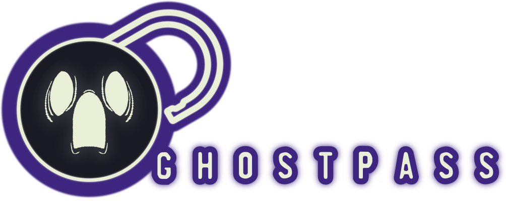

# ghostpass.

Ghostpass is a password manager that generates a new password for every website domain or application that you use, based on your master password. You only need to remember one password to create dozens or hundreds of secure and unique passwords.

## Why use ghostpass?

Unlike traditional password managers, which store those unique passwords in an encrypted database, ghostpass never saves any of them. Instead, it generates them on the fly, only when you need them. As long as you use the same master password, it'll always generate the same password for any given website. This approach has a couple of benefits:
	* You can't forget or lose access to your decryption key, because it doesn't exist.
	* You don't need to worry about your encrypted database being hacked or losing it or being stuck on a different computer without access to it.
	
	
## How it works

When you enter your master password into ghostpass, it hashes it to generate a unique password for the site or application you're using. Ghostpass forgets that password as soon as you close the window, so there's no danger of it being stored or intercepted by anyone else. If you want to keep ghostpass running in the background, it can be set to forget your passwords after 1 minute; plenty of time to copy them over and do what you need to do, without worrying about someone else peeking over your shoulder to grab your private passwords.

Because ghostpass always spits out the same hash when given the same password, you can always access your accounts as long as you remember your original master password and the name of the site or app you're logging into. If you ever lose access to ghostpass, maybe due to hard drive failure, or you're on a different computer, etc- just download it again. You'll have to enter in the name of your sites again, but it'll spit out the same passwords, every time.

# Features

## Password generation

Ghostpass uses variable length, up to 256-bit PBKDF2-based password hashing with base-85 encoding. This means that it generates highly secure passwords that are extremely difficult to brute force. They use plenty of special characters (as in, & | $ # % etc) so they should be accepted by pretty much every password system- no more worries about your site registration throwing a fuss because you didn't use enough numbers and special characters.

## Passphrases

If you prefer to use a memorable passphrase instead of a complex password, ghostpass can generate them as well. These "sentences" are made up of plain English words from a large dictionary and are easier to type and remember than random strings of characters. They are slightly less insanely secure against brute force cracking than pure password hashes - but they're still essentially uncrackable.

## Settings Management

Ghostpass doesn't remember your passwords, but it does remember your sites and apps, as well as a few settings for each- the idea is to keep it simple, but still give you enough flexibility to deal with any difficult password systems you might encounter (IE a new account demands a longer or shorter password than your default, or you cannot simply copy and paste for whatever reason and want to use a passphrase for this one site).

Ghostpass has support for easily exporting or importing your list of sites and the preferences you've set, making it easy to copy your set-up from computer to computer, without worrying too much about the security of the data you're transferring- nothing in there should be too sensitive. If you need to set up ghostpass on a new computer and you don't have a handy settings file to import on hand- well, I've made it simple and minimal just for you. It shouldn't be too much of a pain to get everything back up just the way you left it.

## Second Password (Salt)

Hashing alone will protect you against brute force attacks, but another security risk are what are called 'rainbow tables'. Ghostpass takes some steps to defend against rainbow tables by default, but for an extra layer of protection against targetted rainbow table attacks, you can use a second password. But what even is a rainbow table? Well...

# Notes on Security

## What is a Rainbow Table and Why Does It Matter?

When it comes to password security, there are two things to consider. First, can someone brute force your password by guessing a whole bunch of combinations until they find the right one? With ghostpass, this isn't a concern. Even the least secure passwords generated by ghostpass (a 6-word passphrase or a 20-bit hash) have trillions upon trillions of possible combinations. With a 128-bit hash, there are more possible combinations than there are atoms in the observable universe. And ghostpass allows you to crank it up to 256 bits!

The more realistic threat is if someone somehow gains access to one of your hashed passwords. That is, if a website that holds one of your hashed passwords is itself cracked. If this happens, they could potentially use the hash to find out your master password. This is where rainbow tables come into play. A rainbow table is a look-up table of precomputed hashes and their corresponding passwords. By cross-referencing a stolen hash with a rainbow table, an attacker could discover the original password used to generate the hash.

To prevent this type of attack, ghostpass supports salting your password. Salting involves adding a random number to the hashing process, which exponentially increases the amount of time required to create a rainbow table. Ghostpass uses a second password supplied by you to generate the salt value, allowing you to get the same benefit of random-number salting without needing to remember a nearly 100 digit long random number.

## How Ghostpass Should Be Used

For both optimal security and ease of use, it's recommended to keep your ghostpass settings as minimal as possible. You can change the length of each password, or toggle between passphrases and hashes, but try to avoid changing these settings too much. If you need to make changes to make a specific password work, then make changes. But otherwise, set it and forget it!

Ghostpass allows you to import and export your list of domains and any associated settings. Although the save file shouldn't contain any sensitive information, it does contain the name of all of your sites, so consider renaming any sites if that is in any way an issue- ghostpass will still work just fine even if you call google 'grooble'. Note that ghostpass doesn't store your username for a given app or domain, and I can't recommend you attach it to the name of the site since that information would be kept in plain text on your system. If you want to save your username along with your password, then KeePass is a great option.

## KeePass

KeePass is a free, open-source password manager that offers robust features and enterprise-level security. While ghostpass is designed for simplicity, ease of use, and of course protection against losing any of your passwords, KeePass is ideal for users with more extensive needs. With KeePass, you can store both usernames and passwords in an encrypted password database. Unlike ghostpass, KeePass requires you to manage a password vault, but it provides the same level of secure password generation and more advanced features for anyone who needs them.# ghostpass.

Ghostpass is a password manager that generates a new password for every website domain or application that you use, based on your master password. You only need to remember one password to create dozens or hundreds of secure and unique passwords.

https://keepass.info/

# Installation

(Will fill this out next)
